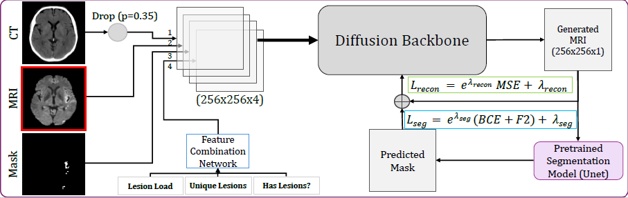

# Mask-Informed Diffusion with Adaptive-weighted Loss

This repository implements a Mask-Informed Diffusion model with Adaptive-weighted loss for medical image analysis. The codebase is built upon [Improved Denoising Diffusion Probabilistic Models](https://arxiv.org/abs/2102.09672).

## Model Architecture

The following figure illustrates the overall architecture of the proposed model:



## Application Parameter

The main training script (`train_ms.py`) supports an `--application` parameter, which determines the task and the type of segmentation model used. This is crucial for adapting the diffusion process to different medical imaging tasks:

- `change_detection`: For bi-temporal change detection tasks (e.g., lesion progression/regression between two time points). Uses a bi-temporal U-Net.
- `modality_conversion`: For cross-modality image translation (e.g., generating one MRI modality from another). Uses a single-modality U-Net.

**Example usage:**
```bash
python train_ms.py --root_dir /path/to/data/ \
                   --csv_file training.csv \
                   --batch_size 4 \
                   --lr 1e-4 \
                   --save_interval 500 \
                   --log_interval 10 \
                   --ema_rate 0.9999 \
                   --use_fp16 False \
                   --world_size 1 \
                   --class_cond True \
                   --rescale_learned_sigmas False \
                   --learn_sigma False \
                   --segmentation_model /path/to/trained/model/ckpoint.pt \
                   --application modality_conversion
```

## Usage

Please see the original repository for installation details.

You require a pre-trained model for bitemporal segmentation of generated images. The repo uses a Bi-temporal U-Net from the glasses repository.

please run the following to train the diffusion model:
```
export CUDA_VISIBLE_DEVICES=1
python train_ms.py --root_dir /path/to/data/ \
                    --csv_file training.csv \
                    --batch_size 4 \
                    --lr 1e-4 \
                    --save_interval 500 \
                    --log_interval 10 \
                    --ema_rate 0.9999 \
                    --use_fp16 False \
                    --world_size 1 \
                    --class_cond True \
                    --rescale_learned_sigmas False \
                    --learn_sigma False \
                    --segmentation_model /path/to/trained/model/ckpoint.pt
```
